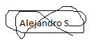

# Informe de Pentesting
|||
|-|-|
|**Aplicación Evaluada**:| Talent ScoutTech|
|**Fecha**:| 28 de enero de 2025|
|**Auditor**:| Alejandro Seoane|
<br>

## Resumen ejecutivo
---

### Descripción del proyecto

Talent ScoutTech, desarrollada por ACME, es una aplicación web diseñada para revolucionar la forma en que se descubren y evalúan talentos deportivos. Esta plataforma permite a los usuarios añadir jugadores interesantes a una base de datos y anexar comentarios sobre su idoneidad para la contratación. Aunque los comentarios no pueden ser editados, los perfiles de los jugadores sí pueden ser actualizados, reflejando cambios como el equipo al que pertenecen.

### Objetivos

Hemos realizado esta evaluación de una aplicación para dos objetivos bastantes claros.

1. El primero será identificar todas las vulnerabilidades críticas  en la aplicación Talent ScoutTech.

2. Luego lo que haremos será proponer soluciones para poder solventar dichas vulnerabilidades.

3. Como última parte haremos una evaluación sobre el alcance e impacto de los problemas que hemos encontrado en la aplicación. 

---

## Vulnerabilidades encontradas

### 1. Inyección SQL

#### Descripción

Hemos identificado vulnerabilidades en algunos de los archivos que forman la aplicación lo que permite a los atacantes realizar inyecciones SQL, para por ejemplo saltarse el proceso de autenticación que tiene la aplicación. 
Esto ocasionaría que un atacante pudiese entrar a la aplicación de forma no autorizada y obtener datos de usuarios.

- **Errores detectado:** Los campos no son procesados mediante consultas preparadas por lo que el código es susceptible a posibles ataques de SQLi. 

#### Solución
La solución para este problema sería utilizar como dije anteriormente consultas preparadas con `prepared`. Esto lo que hace es separar las instrucciones SQL de los datos que insertaremos.

#### Alcance
El alcance a la aplicación es alto debido a que los atacantes podían entrar de forma no autorizada y recoger datos sensibles de usuarios. 

---

### 2. Cross-Site Scripting (XSS)

#### Descripción
Se detectaron vulnerabilidades XSS en la gestión de comentarios de jugadores y otras páginas como `show_comments.php` y `list_players.php`. Esto permite a un atacante inyectar scripts maliciosos. 

- **Ejemplo:**

  ```html
  <script>alert('XSS');</script>
  ```

#### Solución
Implementar funciones de sanitización y escape en el servidor para todas las entradas del usuario, utilizando herramientas como `htmlspecialchars()` y validación estricta de entradas.

#### Alcance
El alacance es alto ya que esta vulnerabilidad afectaría a numerosas partes de la aplicación.

---

### 3. Contraseñas en texto plano

#### Descripción
Las contraseñas de los usuarios no se guardan de forma segura, ya que se almacenan en texto plano en la base de datos.

#### Solución
La solución es crear funciones en el código para hashear esas contraseñas y que sea más dificil desencriptarlas.

#### Alcance
Este cambio también alto debido a que un atacante con acceso a la base de datos podría ver las contraseñas de todos los usuarios. 

---


### 4. Gestión insegura de las sesiones

#### Descripción
Se detectaron vulnerabilidades en la gestión de sesiones, como cookies sin la banderas como `HttpOnly` lo que puede aumentar las posibilidades de suplantación de un usuario

#### Solución
La mejor solución sería hacer una configuración de las cookies con `HttpOnly` para evitar accesos mediante JavaScript.

#### Alcance
Esto protege las sesiones de los usuarios y dificulta que un atacante pueda secuestrar sesiones.

---

## Conclusión

La auditoría que hemos realizado en la aplicación de Talent ScoutTech pudimos identificar numerosas vulnerabilidades críticas que pueden comprometen la seguridad de la aplicación y los datos de los usuarios. Hemos proporcionado algunas soluciones para poder fortalecer la estructura de la aplicación, donde deberían de priorizar las partes donde el alcance es más alto para poder reducir en gran medida el posible impacto de dichas vulnerabilidades en la aplicación. 

**Firma del analista**:   
